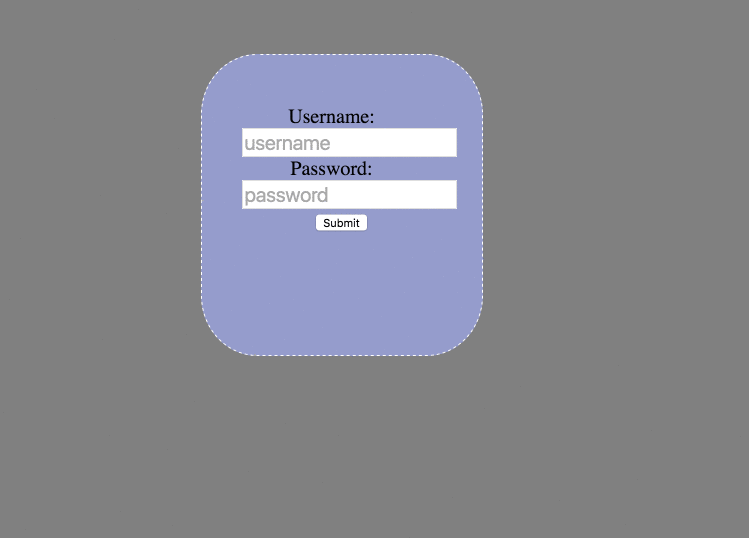

#Created a form validation
###It was a great way to practice form validation. I just created a simple form that checks both length and alpha input for username. password is checked on length only. If invalid a div pops up describing the error and goes away once it has been resolved.  

